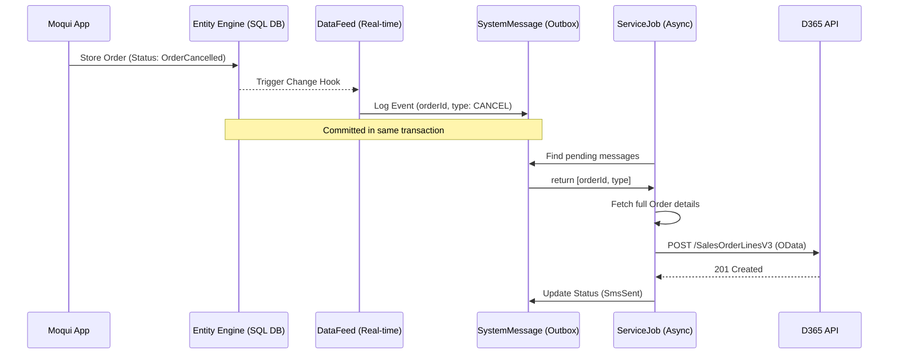

# Proposal: Event-Driven Integration (Outbox Pattern) for ERP Systems (D365/NetSuite)

## Overview
This document proposes a standardized, decoupling-first approach to integrating Moqui's Order/Return/Shipment data with external ERP systems like Dynamics 365 and NetSuite.

## The Problem
Many traditional integrations in Moqui either rely on manual "sweeps" (polling) of entity tables or complex `service-call` chains that happen synchronously during user actions. This leads to:
1. **Performance Bottlenecks**: High-latency API calls to external systems block UI threads or database transactions.
2. **Atomicity Issues**: If an integration service fails after a database change, the external system is out of sync.
3. **Difficult Monitoring**: No centralized "Integration Table" to track which events have been logged but not yet sent.

## The Solution: Moqui "Outbox" Pattern
We propose leveraging Moqui's native `DataFeed`, `DataDocument`, and `SystemMessage` infrastructure to implement an asynchronous **Outbox Pattern**.

### 1. Unified Event Detection (`DataFeed` & `DataDocument`)
Instead of polling `OrderHeader` for status changes, we define a set of `DataDocument`s that capture the core event data.

- **DataDocument**: Lightweight structure containing the `orderId` and `statusId`.
- **DataFeed**: A real-time (`DtfdptRtPush`) monitor that triggers on entity changes. It ensures transactional integrity by only firing after a successful DB commit.

### 2. Integration Event Log (`SystemMessage`)
When a `DataFeed` triggers, it calls a lightweight logging service that generates a `SystemMessage`. This record acts as our persistent "Integration Table".

- **SystemMessageType**: Represents the event (e.g., `ORDER_CREATED`, `ORDER_CANCELLED`, `SHIPMENT_PAID`).
- **Status Tracking**: Messages start in `SmsCreated` and transition to `SmsSent` or `SmsError` upon processing.

### 3. Decoupled Data Synchronization
A separate scheduled job (Moqui `ServiceJob`) periodically polls for pending `SystemMessage` records.
- **Full Data Fetching**: The "Send" service associated with the message type fetches the full transitive entity tree using Moqui's standard `EntityDataDocument` logic.
- **Mapping**: The service maps Moqui's canonical JSON-like Map structure to the target system's (D365/NetSuite) API schema.
- **Guaranteed Delivery**: Provides built-in retries and error reporting via the `SystemMessage` UI.

## Flow Diagram

## Benefits
- **Reliability**: Uses JTA transaction synchronization to ensure database and integration logs remain atomic.
- **Decoupling**: The online transaction remains fast; the integration happens in the background.
- **Traceability**: All outbound messages are auditable via the `SystemMessage` interface.
- **Scalability**: Multiple processors can handle different `SystemMessageType` exports without interfering with each other.
