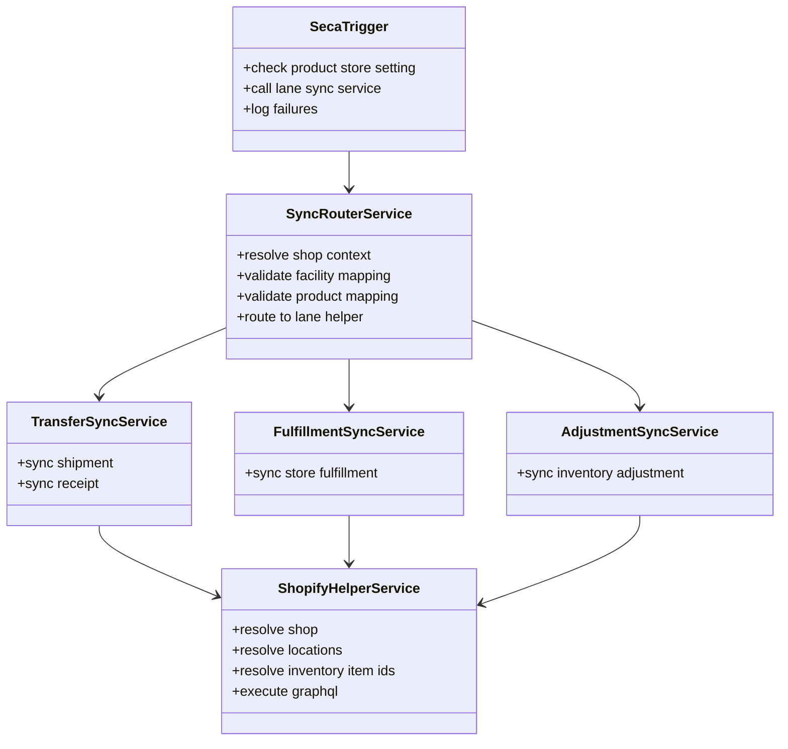

# Shopify Event-Based Inventory Sync Implementation

## Purpose

This document describes a phase 1 implementation for Shopify inventory sync with direct `SECA` action and no dedicated sync history entities.

The goal is to keep the implementation small, understandable, and close to the real OMS business events.

The implementation manages Shopify inventory only for POS/store locations that exist in Shopify. Non-Shopify facilities are out of scope, except the `_NA_` facility reset path used for accumulated inventory.

## Scope

This implementation covers these lanes:

1. Transfer shipment
2. Transfer receipt
3. Store fulfillment shipment
4. Inventory adjustment for cycle count, manual variance, external POS sale, and `_NA_` accumulated inventory reset delta

Reservation sync is intentionally not included in phase 1. For sales orders, Shopify inventory should change when the POS/store shipment is issued, not when OMS reservation happens.

## What Phase 1 Does Not Add

- no sync history entities
- no outbox entity
- no `SystemMessage`
- no scheduled retry table scan
- no generic `InventoryItemDetail` data feed

Phase 1 is immediate-action integration from `SECA` with logging on failure.

## High-Level Design

## Service Roles

### 1. Setting Guard Service

Suggested role:

- `is#ShopifyInventorySyncEnabled`

Responsibility:

- read `ProductStoreSetting`
- return true only when the store is explicitly enabled for Shopify inventory sync
- stop all downstream sync when disabled

This service should be called first by every `SECA` path.

### 2. Sync Router Service

Suggested role:

- `route#ShopifyInventorySync`

Responsibility:

- receive the business key from `SECA`
- determine the event lane
- resolve `productStoreId`
- call the setting guard
- route to the correct lane-specific sync service

This keeps the `SECA` thin and reusable.

### 3. Shopify Context Resolver

Suggested role:

- `resolve#ShopifyInventorySyncContext`

Responsibility:

- resolve `shopId`
- resolve Shopify Admin config
- resolve OMS POS/store facility to Shopify location
- resolve OMS product to Shopify inventory item
- fail fast if required mapping is missing

This service should be shared by all lanes.

### 4. Transfer Sync Services

Suggested roles:

- `sync#TransferShipmentToShopify`
- `sync#TransferReceiptToShopify`

Responsibilities:

`sync#TransferShipmentToShopify`
- find the shipped OMS transfer shipment
- create the prerequisite Shopify transfer if needed
- create `InventoryShipment`
- set tracking when available
- mark shipment in transit

`sync#TransferReceiptToShopify`
- group receipt quantities by `shipmentId + datetimeReceived + facilityId`
- map to the correct Shopify shipment items
- call `inventoryShipmentReceive`

### 5. Store Fulfillment Sync Service

Suggested role:

- `sync#StoreFulfillmentToShopify`

Responsibility:

- resolve Shopify order and fulfillment orders
- compare assigned location with actual OMS shipping store
- move the fulfillment order when required
- create the Shopify fulfillment

This is the correct store-shipment equivalent for Shopify.

### 6. Inventory Adjustment Sync Service

Suggested role:

- `sync#InventoryAdjustmentToShopify`

Responsibility:

- handle adjustment-style deltas only
- call `inventoryAdjustQuantities`

This service should be reused for:

- cycle count
- manual variance
- external POS sale where Shopify did not create the sale
- `_NA_` accumulated inventory reset delta after OMS computes the difference

### 7. Logging Service

Suggested role:

- `log#ShopifyInventorySyncFailure`

Responsibility:

- write one structured application log entry
- keep logging format stable so support can search by business key

Suggested log fields:

- event type
- source service
- orderId
- orderItemSeqId
- shipmentId
- receiptId
- physicalInventoryId
- productStoreId
- facilityId
- shopId
- Shopify location id
- payload summary
- Shopify error text

## SECA Responsibilities

The `SECA` should do only three things:

1. identify the source business key
2. call the router service
3. log failure without disturbing committed OMS work

The `SECA` should not:

- contain business mapping logic
- build GraphQL payloads
- query Shopify directly

## Suggested SECA Layout

| OMS service | SECA timing | Routed sync service |
| --- | --- | --- |
| `co.hotwax.poorti.TransferOrderFulfillmentServices.ship#TransferOrderShipment` | `post-service` | `sync#TransferShipmentToShopify` |
| `ShipmentReceipt` create or update support service | `post-service` or entity hook wrapper | `sync#TransferReceiptToShopify` |
| `co.hotwax.poorti.FulfillmentServices.ship#Shipment` | `post-service` | `sync#StoreFulfillmentToShopify` |
| `co.hotwax.cycleCount.InventoryCountServices.create#PhysicalInventory` | `post-service` | `sync#InventoryAdjustmentToShopify` |
| `reset#InventoryItem` or `create#ExternalInventoryReset` for `_NA_` facility | `post-service` | `sync#InventoryAdjustmentToShopify` |

## Failure Handling

Phase 1 failure handling is intentionally simple:

- OMS business work is already committed
- Shopify sync is attempted immediately
- failure is logged
- no sync history row is created
- replay is manual in phase 1

This is acceptable for the first cut because:

- the design stays small
- the business boundary stays clear
- support can inspect logs by source business key

If failures become frequent, the next enhancement should be a small retry or outbox model. That should be justified by production behavior, not added upfront.

## Service Interaction Example

Example: store-origin TO shipment

1. OMS ships the transfer shipment.
2. `SECA` fires after `ship#TransferOrderShipment`.
3. Router checks `SHOPIFY_INV_SYNC` for the product store.
4. Transfer shipment sync service resolves Shopify context.
5. Service ensures the transfer exists.
6. Service creates Shopify shipment.
7. Service marks shipment in transit.
8. On failure, log the error with `orderId`, `shipmentId`, `facilityId`, and `shopId`.

## Implementation Notes

- keep all Shopify GraphQL calls in helper services, not inside `SECA`
- fail fast on missing location or product mapping
- never hard reset inventory from these event paths
- use adjustment mutations only for adjustment-style events
- use transfer and shipment APIs only for actual transfer movement
- do not mirror OMS lifecycle for control purposes in Shopify
- skip non-Shopify facilities except the explicitly handled `_NA_` accumulated inventory reset path
- do not implement reservation sync in phase 1

## Operational Note

This approach is the right starting point for a small implementation.

It gives immediate sync at the right OMS boundary without introducing extra entities. If reliability gaps appear later, then add persistent replay after observing actual failure patterns.
