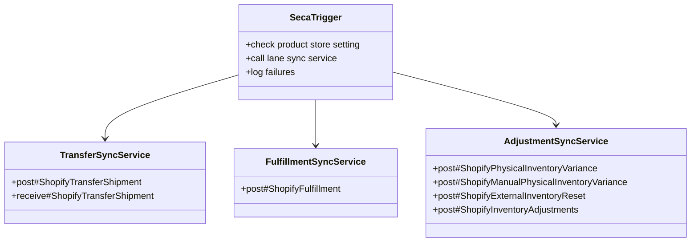

# Shopify Event-Based Inventory Sync Implementation

## Purpose

This document describes the current phase 1 implementation for Shopify inventory sync with direct `SECA` action and no dedicated sync history entities.

The goal is to keep the implementation small, understandable, and close to the real OMS business events.

The implementation manages Shopify inventory only for POS/store locations that exist in Shopify. Non-Shopify facilities are out of scope, except the `_NA_` facility reset path used for accumulated inventory.

## Scope

This implementation covers these lanes:

1. Transfer shipment
2. Transfer receipt
3. Store fulfillment shipment
4. Inventory adjustment for cycle count, manual variance, external POS sale, and `_NA_` accumulated inventory reset delta from `ExternalInventoryReset`

Reservation sync is intentionally not included in phase 1. For sales orders, Shopify inventory should change when the POS/store shipment is issued, not when OMS reservation happens.

## Online Store Inventory Boundary

This implementation is for store and POS inventory events in Shopify. The goal is to keep the store-side inventory movement and event trace aligned with OMS as events occur.

This implementation is not the source for Shopify Online Store PDP inventory in phase 1.

The intended operating model is:

- store inventory events are posted to Shopify as they occur in OMS
- store inventory and transfer movement become visible in Shopify at the relevant store locations
- online available inventory continues to be synchronized by the existing hard sync and upload recent inventory changes jobs

This boundary is important because Shopify calculates online quantity from locations that fulfill online orders. Shopify also allows a location to be prevented from fulfilling online orders, and when that is done the inventory at that location is removed from the product's online quantity shown to customers.

Implementation implication:

- this event-based sync should be used for store locations that are not intended to contribute to online sellable quantity
- under that Shopify location configuration, store event sync keeps Shopify store inventory accurate without changing PDP online available inventory
- if a store location is configured in Shopify to fulfill online orders, then its available inventory can contribute to online quantity and this assumption no longer holds

Expected transition over time:

- as more store-impacting OMS flows move to `SECA`-driven event sync, the hard sync jobs should stop producing store-side inventory changes in normal operation
- those jobs still remain the current source for online available inventory and for any inventory lanes not yet covered by event sync

## What Phase 1 Does Not Add

- no sync history entities
- no outbox entity
- no `SystemMessage`
- no scheduled retry table scan
- no generic `InventoryItemDetail` data feed

Phase 1 is immediate-action integration from `SECA` with logging on failure.

## High-Level Design

## Service Roles

### 1. Transfer Sync Services

Implemented roles:

- `co.hotwax.sob.transfer.ShopifyTransferOrderServices.post#ShopifyTransferShipment`
- `co.hotwax.sob.transfer.ShopifyTransferOrderServices.receive#ShopifyTransferShipment`

Responsibilities:

`post#ShopifyTransferShipment`
- find the shipped OMS transfer shipment
- resolve the Shopify shop from `productStoreId` and mapped route facilities
- aggregate shipment lines by Shopify inventory item
- create Shopify `InventoryTransfer`
- create Shopify `InventoryShipment`
- store created Shopify shipment ids in `ShipmentAttribute` `SHPFY_INV_SHIPMENTS`

`receive#ShopifyTransferShipment`
- process each `ShipmentReceipt` row after commit
- reuse `SHPFY_INV_SHIPMENTS` when already created for the OMS shipment
- if `SHPFY_INV_SHIPMENTS` is missing, initialize Shopify transfer and shipment from the OMS shipment first
- for `TO_Receive_Only`, initialize the Shopify transfer with destination location only and leave origin blank
- call `inventoryShipmentReceive` against the existing Shopify shipment line

### 2. Store Fulfillment Sync Service

Implemented role:

- `co.hotwax.sob.fulfillment.FulfillmentFeedServices.post#ShopifyFulfillment`

Responsibility:

- resolve Shopify order and fulfillment orders
- compare assigned location with actual OMS shipping store
- move the fulfillment order when required
- create the Shopify fulfillment

This is the correct store-shipment equivalent for Shopify.

### 3. Inventory Adjustment Sync Services

Implemented roles:

- `co.hotwax.sob.product.InventoryServices.post#ShopifyPhysicalInventoryVariance`
- `co.hotwax.sob.product.InventoryServices.post#ShopifyManualPhysicalInventoryVariance`
- `co.hotwax.sob.product.InventoryServices.post#ShopifyExternalInventoryReset`
- `co.hotwax.sob.product.InventoryServices.post#ShopifyInventoryAdjustments`

Responsibility:

- handle adjustment-style deltas only
- call `inventoryAdjustQuantities`

This service should be reused for:

- cycle count
- manual variance
- external POS sale where Shopify did not create the sale
- `_NA_` accumulated inventory reset delta from the created `ExternalInventoryReset` record

Manual variance is intentionally filtered:

- `post#ShopifyManualPhysicalInventoryVariance` only syncs when the persisted `InventoryItemDetail` rows for the `physicalInventoryId` do not carry `orderId`, `returnId`, or `shipmentId`
- this prevents order-specific, shipment-specific, or return-specific physical inventory records from being pushed as manual adjustment deltas

## SECA Responsibilities

The `SECA` should do only three things:

1. identify the source business key
2. call the lane sync service
3. log failure without disturbing committed OMS work

The `SECA` should not:

- contain business mapping logic
- build GraphQL payloads
- query Shopify directly

## Suggested SECA Layout

| OMS service | SECA timing | Sync service |
| --- | --- | --- |
| `co.hotwax.poorti.TransferOrderFulfillmentServices.ship#TransferOrderShipment` | `post-commit` | `co.hotwax.sob.transfer.ShopifyTransferOrderServices.post#ShopifyTransferShipment` |
| `create#org.apache.ofbiz.shipment.receipt.ShipmentReceipt` | `post-commit` | `co.hotwax.sob.transfer.ShopifyTransferOrderServices.receive#ShopifyTransferShipment` |
| `co.hotwax.poorti.FulfillmentServices.ship#Shipment` | `post-commit` | `co.hotwax.sob.fulfillment.FulfillmentFeedServices.post#ShopifyFulfillment` |
| `co.hotwax.cycleCount.InventoryCountServices.create#PhysicalInventory` | `post-commit` | `co.hotwax.sob.product.InventoryServices.post#ShopifyPhysicalInventoryVariance` |
| `co.hotwax.poorti.FulfillmentServices.create#PhysicalInventory` | `post-commit` | `co.hotwax.sob.product.InventoryServices.post#ShopifyManualPhysicalInventoryVariance` |
| `create#ExternalInventoryReset` | `post-commit` | `co.hotwax.sob.product.InventoryServices.post#ShopifyExternalInventoryReset` |

## Failure Handling

Phase 1 failure handling is intentionally simple:

- OMS business work is already committed
- Shopify sync is attempted immediately
- failure is logged
- no sync history row is created
- replay is manual in phase 1

Current async behavior is lane-specific:

- transfer shipment sync is async
- fulfillment sync is async
- cycle count variance sync is async
- receipt sync is intentionally not async, to avoid parallel `ShipmentReceipt` rows creating duplicate Shopify transfer/shipment records for the same OMS shipment
- manual physical inventory sync remains immediate post-commit with `ignore-error="true"`

This is acceptable for the first cut because:

- the design stays small
- the business boundary stays clear
- support can inspect logs by source business key

If failures become frequent, the next enhancement should be a small retry or outbox model. That should be justified by production behavior, not added upfront.

## Service Interaction Example

Example: `TO_Receive_Only` warehouse-to-store receipt

1. OMS creates the transfer order and advances it through approval into pending receipt.
2. OMS creates `ShipmentReceipt` rows as the store receives inventory.
3. `SECA` fires after each `ShipmentReceipt` commit.
4. Receipt sync resolves the Shopify shop, destination location, and product inventory item mapping.
5. If `SHPFY_INV_SHIPMENTS` already exists on the OMS shipment, the service reuses those Shopify shipment ids.
6. If `SHPFY_INV_SHIPMENTS` is missing, the service initializes Shopify transfer and shipment from the OMS shipment.
7. For `TO_Receive_Only`, the created Shopify transfer uses destination location only, so origin remains blank on Shopify.
8. The service then calls `inventoryShipmentReceive` for the accepted quantity on the matching Shopify shipment line.
9. Subsequent receipt rows for the same OMS shipment reuse the stored Shopify shipment ids instead of creating new receipt-side Shopify documents.

## Implementation Notes

- fail fast on missing location or product mapping
- never hard reset inventory from these event paths
- use adjustment mutations only for adjustment-style events
- use transfer and shipment APIs only for actual transfer movement
- do not mirror OMS lifecycle for control purposes in Shopify
- skip non-Shopify facilities except the explicitly handled `_NA_` accumulated inventory reset path
- do not implement reservation sync in phase 1
- persist Shopify transfer shipment ids on the OMS shipment using `ShipmentAttribute` `SHPFY_INV_SHIPMENTS`
- for `TO_Receive_Only`, treat shipment-level initialization as the normal path when no prior Shopify shipment exists
- one `ExternalInventoryReset` row currently results in one Shopify adjustment call; reset rows are not grouped by `resetDateResourceId` in phase 1

## Shopify Support Basis

The above online inventory boundary is consistent with Shopify's documented behavior:

- Shopify states that `available` inventory is the inventory that can be sold, while `incoming` inventory is not available to sell until it is received
- Shopify states that online orders are assigned based on available inventory at locations that fulfill online orders
- Shopify states that preventing a location from fulfilling online orders removes that location's inventory from the product's online quantity shown to customers

Official references:

- Shopify inventory states: https://help.shopify.com/en/manual/products/inventory/managing-inventory-quantities/inventory-states
- Shopify location fulfillment for online orders: https://help.shopify.com/en/manual/fulfillment/setup/locations/fulfillment
- Shopify multi-location inventory and online quantity: https://help.shopify.com/en/manual/locations/assigning-inventory-to-locations
- Shopify fulfillable inventory behavior: https://help.shopify.com/en/manual/fulfillment/setup/fulfillable-inventory

## Shopify Resources Used In This Implementation

This implementation relies on these Shopify Admin GraphQL resources and mutations:

- `InventoryTransfer` object
- `InventoryShipment` object
- `inventoryTransferCreateAsReadyToShip`
- `inventoryShipmentCreateInTransit`
- `inventoryShipmentReceive`
- `inventoryAdjustQuantities`
- `fulfillmentOrderMove`
- `fulfillmentCreate`

These resources are sufficient for phase 1 because the design goal is not to mirror OMS order orchestration in Shopify. The goal is to reflect store-side inventory movement and shipment events in Shopify as OMS commits them.

## Idempotency Introduction Should Not Be Left Out

A follow-up improvement should add Shopify-side idempotency for the inventory movement and inventory adjustment mutations that support it. This is important because OMS `SECA`-driven event sync can still face replay scenarios from manual rerun, service retry, duplicate trigger delivery, or uncertain remote outcome after network failure.

Current implementation position:

- OMS-side correlation already reduces duplicate transfer posting through `ShipmentAttribute` `SHPFY_INV_SHIPMENTS`
- OMS-side shipment fulfillment correlation already stores the returned Shopify fulfillment id on the OMS shipment
- phase 1 does not yet pass Shopify GraphQL idempotency for supported inventory mutations

Recommended next step:

- introduce deterministic idempotency keys derived from OMS event identity for `inventoryTransferCreateAsReadyToShip`, `inventoryShipmentCreateInTransit`, `inventoryShipmentReceive`, and `inventoryAdjustQuantities`
- keep OMS-side correlation checks as the first line of defense
- continue to treat fulfillment sync separately unless Shopify explicitly documents idempotent support for the fulfillment mutations being used

This should be treated as an important reliability enhancement, especially for inventory adjustments, because duplicate replay of a delta mutation can apply the same quantity change twice.

## Operational Note

This approach is the right starting point for a small implementation.

It gives immediate sync at the right OMS boundary without introducing extra entities. If reliability gaps appear later, then add persistent replay after observing actual failure patterns.
