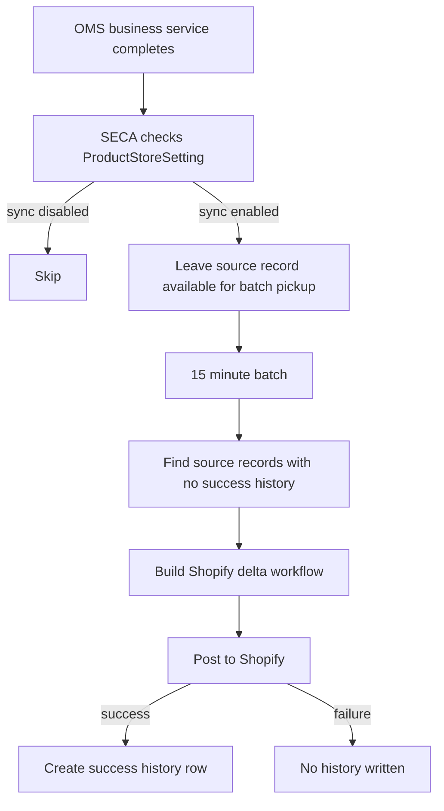
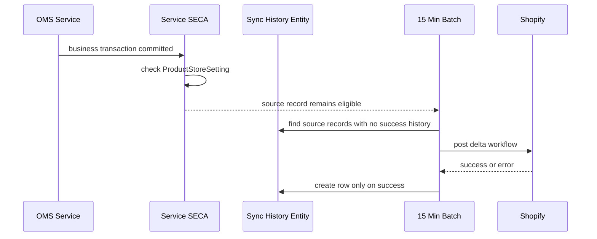

# Shopify Event-Based Inventory Sync Triggers

## Purpose

This document defines a simple event-driven design for keeping Shopify inventory aligned with OMS.

OMS remains the system of record. Shopify is updated only to reflect inventory impact at mapped Shopify locations. The design is delta-based only. It does not use hard inventory reset during the day.

## Pre-Requisites

- OMS and Shopify inventory levels must match before this design is enabled.
- Sync must run only for product stores where a dedicated `ProductStoreSetting`, for example `SHOPIFY_INV_SYNC`, enables Shopify inventory sync.
- If the product store setting is off, no trigger should create history and no batch should post inventory to Shopify.

Without a matched starting baseline, a delta-only design will drift instead of converge.

## Design Summary

The model has four lanes:

1. Store fulfillment events
2. Transfer shipment events
3. Inventory adjustment events
4. External reset events

The design should work like this:

1. A service SECA runs after the OMS business service completes.
2. The SECA does not create history. It only marks the source event as eligible for sync by virtue of the source record existing.
3. A batch service runs every 15 minutes.
4. The batch finds source records for which no success history exists and posts the required Shopify delta workflow.
5. A history row is written only after the Shopify call succeeds.

This gives two layers of safety:

- primary event capture through service SECAs
- recovery through the 15-minute batch

This design does not use `SystemMessage`.

## Core Principles

- OMS decides the business event.
- Shopify receives only the inventory effect of that event.
- Only deltas are posted to Shopify.
- No daytime hard reset should be used for these flows.
- Each trigger source gets its own sync history entity, but history is success-only.
- If no history exists for a source record, it is treated as not yet synced.
- Transfer lifecycle is not mirrored in Shopify for business control. Transfer APIs are used only when Shopify requires them for inventory movement.

## Sync Architecture

### Trigger Model

Use service SECAs on the OMS services that already represent the committed business boundary.

Do not use a broad data feed on `InventoryItemDetail` or `Shipment`. Those are too generic and will create unnecessary load and ambiguity.

### History Model

Each trigger source should have its own history entity. Example split:

| Source event | History entity |
| --- | --- |
| TO reservation at store | `ShopifyToReservationSyncHistory` |
| TO outbound shipment | `ShopifyTransferShipmentSyncHistory` |
| TO inbound receipt | `ShopifyTransferReceiptSyncHistory` |
| Store fulfillment shipment | `ShopifyStoreFulfillmentSyncHistory` |
| Cycle count or manual variance | `ShopifyInventoryAdjustmentSyncHistory` |
| External reset delta | `ShopifyExternalResetSyncHistory` |
| SO cancel or reject reservation release | `ShopifySalesReservationReleaseSyncHistory` |
| TO cancel or reject reservation release | `ShopifyToReservationReleaseSyncHistory` |

Each history row should store at least:

- source business key
- productStoreId
- facilityId
- shopId when resolved
- event type
- delta quantity payload or enough data to derive it
- Shopify reference created by the successful call when relevant
- sent date

No history row should be written for failed or skipped attempts. Absence of history means the source record is still unsynced.

## Processing Flow

## Sequence View

## Trigger Matrix

| OMS event | SECA trigger boundary | Sync history entity | Shopify workflow | Notes |
| --- | --- | --- | --- | --- |
| Store-origin TO reservation reduces ATP | `co.hotwax.oms.impl.OrderReservationServices.process#OrderItemAllocation` after commit, only for transfer orders originating from stores | `ShopifyToReservationSyncHistory` | Create or update a minimal Shopify `InventoryTransfer` and move it to `READY_TO_SHIP` so origin `available` decreases and `reserved` increases | This is needed only because Shopify cannot create `InventoryShipment` without `InventoryTransfer` |
| Store-origin TO outbound shipment reduces QOH | `co.hotwax.poorti.TransferOrderFulfillmentServices.ship#TransferOrderShipment` post-service | `ShopifyTransferShipmentSyncHistory` | Create `InventoryShipment`, then mark it in transit | This reproduces origin `on_hand` reduction and destination `incoming` increase |
| TO inbound receipt into store increases ATP and QOH | `ShipmentReceipt` create or update, grouped by `shipmentId + datetimeReceived + facilityId` | `ShopifyTransferReceiptSyncHistory` | `inventoryShipmentReceive` | Receipt must be shipment-backed for Shopify; non-shipment OMS receipts stay in exception handling |
| Online order shipped from store | `co.hotwax.poorti.FulfillmentServices.ship#Shipment` post-service | `ShopifyStoreFulfillmentSyncHistory` | Move Fulfillment Order to actual store when needed, then create fulfillment | This ensures Shopify applies fulfillment against the actual shipping store |
| External POS sale or non-Shopify sale reduces inventory | dedicated sales posting service boundary | `ShopifyInventoryAdjustmentSyncHistory` | `inventoryAdjustQuantities` | Use only when Shopify is not already the system that created the sale |
| Cycle count or approved manual variance changes QOH and ATP | `co.hotwax.cycleCount.InventoryCountServices.create#PhysicalInventory` when variance is applied | `ShopifyInventoryAdjustmentSyncHistory` | `inventoryAdjustQuantities` | Manual variance follows the same lane |
| External reset accepted by OMS | `reset#InventoryItem` or `create#ExternalInventoryReset` completion | `ShopifyExternalResetSyncHistory` | `inventoryAdjustQuantities` using computed delta only | Even this lane stays delta-based after OMS computes the difference |
| TO cancel before shipment or receipt | `co.hotwax.orderledger.order.TransferOrderServices.cancel#TransferOrder` post-service | `ShopifyToReservationReleaseSyncHistory` | Cancel the related Shopify transfer or remove remaining draft or ready quantities so origin `available` is restored | Use this only to reverse inventory already deducted on Shopify by the earlier reservation delta; OMS blocks TO cancel once shipment or receipt has started |
| TO reject before shipment | `co.hotwax.poorti.TransferOrderFulfillmentServices.reject#TransferOrder` post-service | `ShopifyToReservationReleaseSyncHistory` | Cancel the related Shopify transfer or remove remaining quantities from the sellable route | Use this only to reverse inventory already deducted on Shopify by the earlier reservation delta; OMS reject also cancels reservation and moves the item to `REJECTED_ITM_PARKING` |
| SO cancel before shipment | `co.hotwax.orderledger.order.OrderServices.cancel#SalesOrderItem` post-service | `ShopifySalesReservationReleaseSyncHistory` | Reverse the earlier reservation delta so facility `available` increases | Use this when OMS owned the reservation that had already reduced Shopify ATP |
| SO reject before shipment | `co.hotwax.oms.order.OrderServices.reject#OrderItem` post-service | `ShopifySalesReservationReleaseSyncHistory` | Reverse the earlier reservation delta so facility `available` increases | Use this when OMS owned the reservation that had already reduced Shopify ATP |

## Shopify Workflow By Lane

### 1. Store Fulfillment Lane

Use this for online orders fulfilled from a retail store.

Workflow:

1. Resolve the Shopify order and open fulfillment orders.
2. Resolve the actual shipping facility in OMS.
3. If Shopify assigned a different location, move the fulfillment order to the actual store.
4. Create the Shopify fulfillment from that store.

### 2. Transfer Shipment Lane

Use this for store to warehouse, warehouse to store, and store to store transfer movement.

Workflow:

1. On OMS reservation, create the minimum `InventoryTransfer` needed for Shopify inventory reservation.
2. On OMS ship, create `InventoryShipment` and mark it in transit.
3. On OMS receive, call `inventoryShipmentReceive`.
4. On OMS cancel or reject before ship, cancel or shrink the Shopify transfer so reserved stock is released.

### 3. Inventory Adjustment Lane

Use this for:

- cycle count
- manual variance
- external POS sale when Shopify did not create the sale
- reservation release adjustments when a compensation delta is simpler than a transfer cancellation

Workflow:

1. Resolve location and inventory item.
2. Build delta quantity change.
3. Post `inventoryAdjustQuantities`.

### 4. External Reset Lane

Use this when an external system sends a new truth to OMS and OMS computes a difference.

Workflow:

1. OMS computes the delta.
2. Store the delta in reset sync history.
3. Post only the delta to Shopify.

This lane does not hard reset Shopify. It remains delta-only.

## Why This Model Is Lower Load

- SECAs fire only when the real OMS business service succeeds.
- History rows isolate Shopify sync from the transactional service path.
- The 15-minute batch is simple and bounded.
- Recovery is based on missing success history, not on rescanning all inventory ledger rows.
- Each lane is independent, so TO receipt logic does not pollute store fulfillment or cycle count logic.
