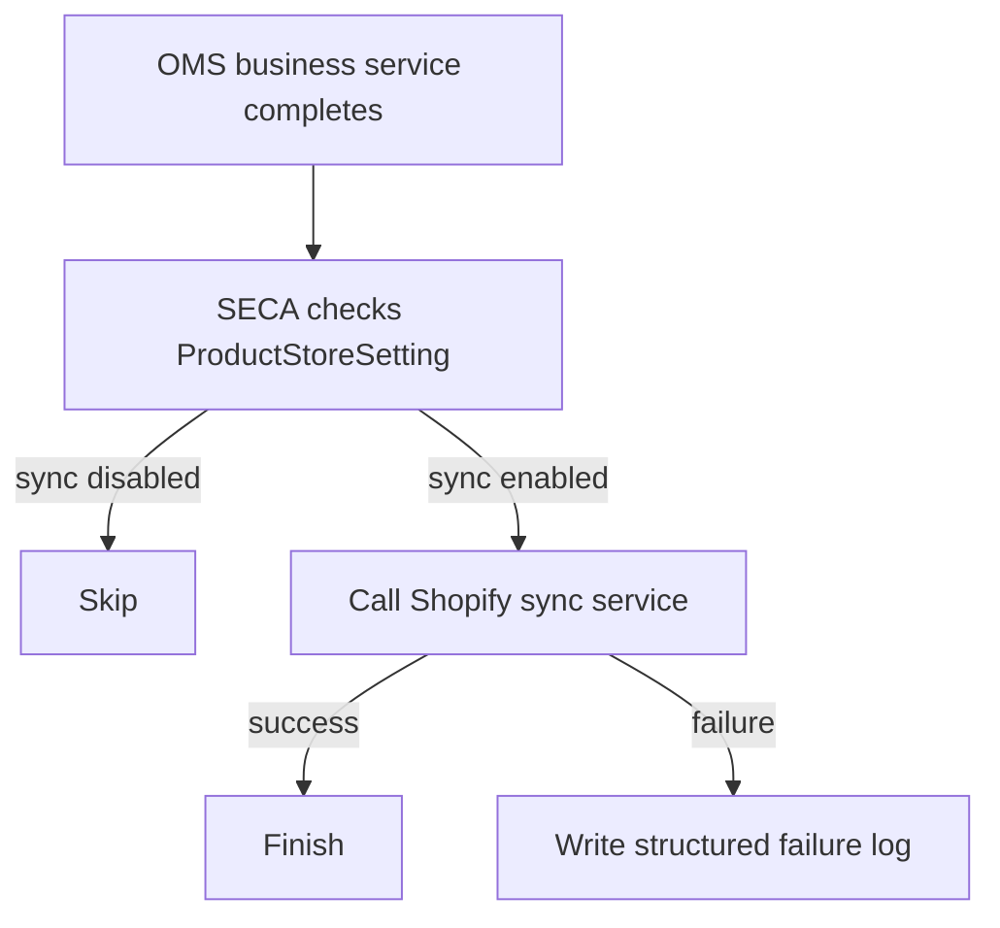
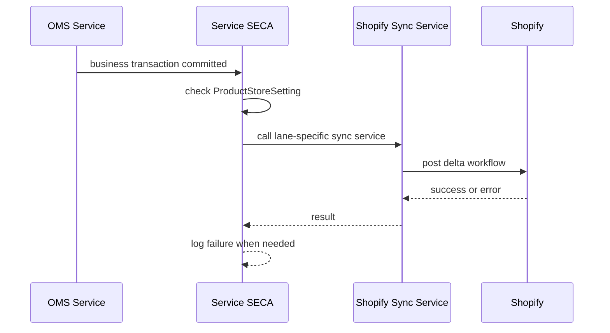

# Shopify Event-Based Inventory Sync Triggers

## Purpose

This document defines the trigger points for a simple OMS to Shopify inventory sync.

OMS remains the system of record. Shopify is updated only for the inventory effect of OMS events at mapped Shopify locations. The design is delta-based only. It does not use daytime hard reset.

The scope is POS/store locations that exist in Shopify. Non-Shopify facilities are not part of this event sync.

## Pre-Requisites

- OMS and Shopify inventory levels must match before this design is enabled.
- Sync must run only for product stores where a dedicated `ProductStoreSetting`, for example `SHOPIFY_INV_SYNC`, enables Shopify inventory sync.
- If the product store setting is off, the `SECA` must not attempt Shopify inventory sync.
- Facility must map to a Shopify POS/store location before any store inventory delta is posted.

Without a matched starting baseline, a delta-only design will drift instead of converge.

## Design Summary

Phase 1 is intentionally simple:

1. A service `SECA` runs after the OMS business service completes.
2. The `SECA` immediately tries to post the Shopify delta workflow.
3. If Shopify sync succeeds, nothing else is persisted just for sync tracking.
4. If Shopify sync fails or the trigger path is missed, log the failure context for support and manual replay.

This design does not use `SystemMessage`. It also does not introduce sync history entities in phase 1.

## Core Principles

- OMS decides the business event.
- Shopify receives only the inventory effect of that event.
- Only deltas are posted to Shopify.
- No daytime hard reset should be used for these flows.
- `SECA` is the primary integration trigger.
- Failure handling is log-first in phase 1.
- Transfer lifecycle is not mirrored in Shopify for business control. Transfer APIs are used only when Shopify requires them for inventory movement.
- Phase 1 does not sync reservation events. Inventory is posted to Shopify when OMS creates the physical movement or correction event, such as shipment issuance, receipt, or cycle count variance.

## Processing Flow

## Sequence View

## Trigger Matrix

| OMS event | SECA trigger boundary | Sync service | Shopify workflow | Notes |
| --- | --- | --- | --- | --- |
| Store-origin TO outbound shipment reduces QOH | `co.hotwax.poorti.TransferOrderFulfillmentServices.ship#TransferOrderShipment` post-service | `sync#TransferShipmentToShopify` | Create `InventoryShipment`, then mark it in transit | This reproduces origin `on_hand` reduction and destination `incoming` increase |
| TO inbound receipt into store increases ATP and QOH | `ShipmentReceipt` create or update, grouped by `shipmentId + datetimeReceived + facilityId` | `sync#TransferReceiptToShopify` | `inventoryShipmentReceive` | Receipt must be shipment-backed for Shopify; non-shipment OMS receipts stay in exception handling |
| Online order shipped from store | `co.hotwax.poorti.FulfillmentServices.ship#Shipment` post-service | `sync#StoreFulfillmentToShopify` | Move Fulfillment Order to actual store when needed, then create fulfillment | This ensures Shopify applies fulfillment against the actual shipping store |
| External POS sale or non-Shopify sale reduces inventory | dedicated sales posting or issuance boundary | `sync#InventoryAdjustmentToShopify` | `inventoryAdjustQuantities` | Use only when Shopify is not already the system that created the sale; Shopify POS orders are already handled by Shopify |
| Cycle count or approved manual variance changes QOH and ATP | `co.hotwax.cycleCount.InventoryCountServices.create#PhysicalInventory` when variance is applied | `sync#InventoryAdjustmentToShopify` | `inventoryAdjustQuantities` | Manual variance follows the same lane |
| `_NA_` facility reset for accumulated inventory | `reset#InventoryItem` or `create#ExternalInventoryReset` completion for `_NA_` facility | `sync#InventoryAdjustmentToShopify` | `inventoryAdjustQuantities` using computed delta only | This is for accumulated inventory pushed through `_NA_`; store-level POS inventory should still be event-driven by shipment, receipt, and correction events |

## Shopify Workflow By Lane

### 1. Store Fulfillment Lane

Use this for online orders fulfilled from stores.

Workflow:

1. Resolve the Shopify order and open fulfillment orders.
2. Resolve the actual shipping facility in OMS.
3. If Shopify assigned a different location, move the fulfillment order to the actual store.
4. Create the Shopify fulfillment from that store.

### 2. Transfer Shipment Lane

Use this for store to warehouse, warehouse to store, and store to store transfer movement.

Workflow:

1. On OMS ship, create the minimum `InventoryTransfer` needed to support Shopify `InventoryShipment`.
2. Create `InventoryShipment` and mark it in transit.
3. On OMS receive, call `inventoryShipmentReceive`.

No reservation sync is included in phase 1.

### 3. Inventory Adjustment Lane

Use this for:

- cycle count
- manual variance
- external POS sale when Shopify did not create the sale
- external reset delta for `_NA_` accumulated inventory after OMS computes the difference

Workflow:

1. Resolve location and inventory item.
2. Build delta quantity change.
3. Post `inventoryAdjustQuantities`.

## Logging And Missed Events

Phase 1 does not create retry entities or sync history entities.

If a `SECA` call fails or a trigger path is missed, log enough information to support replay:

- event type
- source service name
- orderId, shipmentId, receiptId, or physicalInventoryId
- productStoreId
- facilityId
- resolved shopId
- resolved Shopify location id
- payload summary
- Shopify error text

This is enough to start with immediate sync and operational visibility. Persistent replay tables or scheduled retry can be added later if the failure pattern justifies the extra model.
