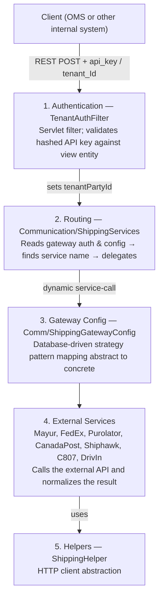
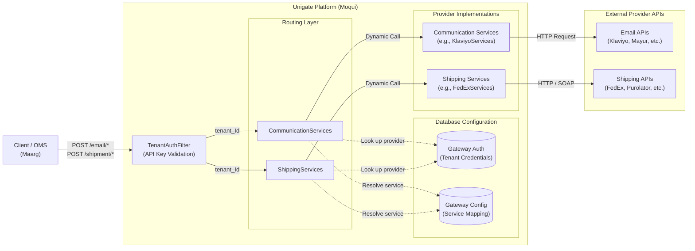

# Unigate — Unified Communication and Shipping Gateway

Unigate is a **multi-tenant API gateway** built on the Moqui Enterprise Framework. It gives OMS and other internal systems a single, stable REST interface for two families of third-party integrations:

- **[UniMail](./unimail/README.md)** — Email delivery and lifecycle event tracking (Klaviyo, Mayur, and future providers)
- **[UniShip](./uniship/README.md)** — Shipping rates, label generation, and label refunds (FedEx, Purolator, Canada Post, ShipHawk, C807, DrivIn)

Callers never deal with provider-specific APIs, authentication schemes, or payload formats. They authenticate once as a tenant, pass a gateway auth ID, and get a normalized response back regardless of which carrier or email provider sits behind it.

---

## How It Works

Unigate is structured in five distinct layers, each with a single responsibility:



---

## Architecture



---

## Package Layout

```
co.hotwax.unigate                   ← Core authentication and routing
├── TenantAuthFilter.groovy         ← Servlet filter (api_key / tenant_Id auth)
├── helper/
│   └── ShippingHelper.groovy       ← HTTP client abstraction
├── service/co/hotwax/unigate/
│   ├── ApiInterfaceServices.xml    ← Interface contracts (do not modify)
│   ├── CommunicationServices.xml   ← Email routing
│   ├── ShippingServices.xml        ← Shipping routing
│   └── UnigateTenantServices.xml   ← Tenant + API key creation
└── service/co/hotwax/
    ├── communication/
    │   ├── mayur/                  ← Mayur email implementation
    │   └── klaviyo/                ← Klaviyo email implementation
    └── shipping/
        ├── fedex/                  ← FedEx
        ├── purolator/              ← Purolator (SOAP)
        ├── canadapost/             ← Canada Post (XML)
        ├── shiphawk/               ← ShipHawk (JSON)
        ├── c807/                   ← C807 (JSON + OAuth cache)
        └── drivin/                 ← DrivIn (JSON + QR labels)
```

---

## Multi-Tenancy Model

Every request is scoped to a **tenant** — a `Party` record of type `PtyOrganization`. Tenants authenticate with a hashed API key stored in `UserLoginKey`, and their carrier credentials live in separate `CommGatewayAuth` / `ShippingGatewayAuth` records linked by `tenantPartyId`.

This means:
- A single tenant can have credentials for multiple carriers simultaneously
- A single carrier config (`ShippingGatewayConfig`) can serve many tenants with different credentials
- Adding a carrier for a new tenant is a data operation — no code change required

See [Tenant Onboarding](./tenant-onboarding.md) for how to provision a new tenant end-to-end.

---

## Key Design Decisions

**Database-driven routing** — which service handles a request is read from `CommGatewayConfig.sendEmailServiceName` or `ShippingGatewayConfig.getRateServiceName`. There are no `if/else` chains on carrier names in the routing layer; adding a carrier only requires a new service and a database record.

**API keys are hashed at rest** — Unigate stores the SHA-based hash of the API key, never the plaintext. The plaintext is returned only once at generation time.

**Stateless pass-through** — Unigate does not persist shipment or email data. Every request is fully self-contained; the OMS owns the data lifecycle.

**Token caching** — C807 and FedEx use short-lived OAuth tokens. These are cached in Moqui's distributed cache keyed by `tenantPartyId|shippingGatewayConfigId` to avoid a token round-trip on every label request. See carrier implementation docs for details.

---

## Documentation Index

| Document | What it covers |
|---|---|
| [Tenant Onboarding](./tenant-onboarding.md) | Provisioning a new tenant end-to-end |
| [TenantAuthFilter](./TenantAuthFilter.md) | How request authentication works |
| [Entity Model](./entity/entity-model.md) | All entities and their relationships |
| [CommGatewayAuth](./entity/CommGatewayAuth.md) | Tenant email credentials |
| [ShippingGatewayAuth](./entity/ShippingGatewayAuth.md) | Tenant shipping credentials |
| [ShippingGatewayConfig](./entity/ShippingGatewayConfig.md) | Gateway service routing config |
| [UniMail](./unimail/README.md) | Email gateway — APIs, routing, entities |
| [Add Email Gateway](./unimail/add-email-gateway.md) | How to integrate a new email provider |
| [send#EmailCommunication](./unimail/services/send-email-communication.md) | Email sending service design |
| [create#EmailFlow](./unimail/services/create-email-flow.md) | Automated flow provisioning design |
| [get#EmailFlow](./unimail/services/get-email-flow.md) | Flow status retrieval design |
| [create#WorkflowEvent](./unimail/services/create-workflow-event.md) | Custom event triggering design |
| [UniShip](./uniship/README.md) | Shipping gateway — APIs, carriers, label pipeline |
| [Add Shipping Carrier](./uniship/add-shipping-carrier.md) | How to integrate a new carrier |
| [Carrier Account Management](./uniship/CarrierAccountManagement.md) | Multi-account / per-facility credential pattern |
| [get#ShippingRate](./uniship/services/get-shipping-rate.md) | Rate service design |
| [request#ShippingLabels](./uniship/services/requestShippingLabel.md) | Label request service design |
| [refund#ShippingLabels](./uniship/services/refundShippingLabels.md) | Label refund service design |


