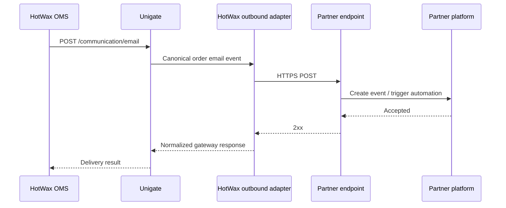

# External Partner Integration for Order Email Events

This guide is for partners that want to consume HotWax order lifecycle events and trigger transactional email or marketing automation in their own platform. Partners host the integration endpoint; they do not add services, templates, or deployment artifacts to Unigate.

## Integration Model



The partner owns the receiver and provider-specific mapping. HotWax owns tenant setup, event routing, and the outbound adapter inside Unigate.

> **Platform prerequisite:** `CommGatewayConfig` routes requests to service names that are already deployed in Unigate. Database configuration can switch between installed adapters, but it cannot call an arbitrary partner endpoint by itself. HotWax must confirm that a provider-neutral outbound adapter is enabled for the target environment before certification. The partner must not be asked to fork or deploy Unigate.

## Responsibilities

| Owner | Responsibility |
| --- | --- |
| Partner | Host an HTTPS endpoint, authenticate HotWax requests, validate the event, map it to the partner API, and return a meaningful HTTP status. |
| HotWax | Provision a test tenant, enable the outbound adapter, configure endpoint credentials, map product-store email types, and provide test events. |
| Retailer | Approve the event catalog, sender identity, templates or automations, and production credentials. |

## Endpoint Contract

The partner endpoint must:

- accept `POST` requests with `Content-Type: application/json` over HTTPS;
- support the authentication scheme agreed during onboarding;
- return a `2xx` status only after the event has been accepted for processing;
- return `400` or `422` for a permanently invalid payload;
- return `401` or `403` for invalid credentials;
- return `429` with `Retry-After` when rate limited;
- return `5xx` for a temporary partner-side failure;
- tolerate retries and duplicate deliveries; and
- ignore unknown JSON fields so additive contract changes remain compatible.

The response body is optional. When present, this shape is recommended:

```json
{
  "accepted": true,
  "externalEventId": "evt_01JEXAMPLE"
}
```

## Canonical Event

The outbound adapter should preserve the canonical `send#EmailCommunication` envelope. A representative order event is shown below.

```json
{
  "commGatewayAuthId": "PARTNER_TEST",
  "emailType": "READY_FOR_PICKUP",
  "subject": "Your order is ready for pickup",
  "emailAddress": "alex@example.com",
  "messageData": {
    "orderId": "10001",
    "orderName": "WEB-10001",
    "orderDate": "2026-08-11T08:10:00Z",
    "completedDatetime": "",
    "orderStatusUrl": "https://example.com/orders/WEB-10001",
    "orderUpdateUrl": "",
    "grandTotal": 108.25,
    "firstName": "Alex",
    "lastName": "Morgan",
    "brandName": "Example Store",
    "sandbox": true,
    "isStorePickup": true,
    "facilityAddress": {
      "toName": "Example Store Downtown",
      "facilityName": "Downtown",
      "address1": "100 Main Street",
      "address2": "",
      "city": "New York",
      "stateProvinceGeoId": "NY",
      "postalCode": "10001",
      "countryGeoId": "USA",
      "latitude": "40.7505",
      "longitude": "-73.9934",
      "phoneNumber": "+12125550100"
    },
    "shippingAddress": {},
    "billingAddress": {},
    "items": [
      {
        "productId": "SKU-RED-M",
        "shipGroupSeqId": "00001",
        "color": "Red",
        "size": "M",
        "quantity": 1,
        "unitPrice": 100.0,
        "itemDescription": "Red shirt",
        "productName": "Classic Shirt",
        "productImageUrl": "https://example.com/images/red-shirt-m.jpg",
        "parentProductImageUrl": "https://example.com/images/red-shirt.jpg",
        "itemStatus": "ITEM_APPROVED",
        "itemUrl": "https://example.com/products/classic-shirt",
        "shipmentMethodTypeId": "STOREPICKUP",
        "trackingUrl": "",
        "trackingCode": "",
        "shipFromAddress": {},
        "adjustments": [
          {
            "orderAdjustmentTypeId": "EXT_PROMO_ADJUSTMENT",
            "amount": -10.0,
            "comments": "Welcome discount"
          }
        ]
      }
    ],
    "allItems": [
      {
        "productId": "SKU-RED-M",
        "shipGroupSeqId": "00001",
        "color": "Red",
        "size": "M",
        "quantity": 1,
        "unitPrice": 100.0,
        "itemDescription": "Red shirt",
        "productName": "Classic Shirt",
        "productImageUrl": "https://example.com/images/red-shirt-m.jpg",
        "parentProductImageUrl": "https://example.com/images/red-shirt.jpg",
        "itemStatus": "ITEM_APPROVED",
        "itemUrl": "https://example.com/products/classic-shirt",
        "shipmentMethodTypeId": "STOREPICKUP",
        "trackingUrl": "",
        "trackingCode": "",
        "shipFromAddress": {},
        "adjustments": []
      }
    ],
    "adjustments": [
      {
        "orderAdjustmentTypeId": "SHIPPING_CHARGES",
        "amount": 8.25,
        "comments": ""
      }
    ],
    "additionalFields": {}
  }
}
```

### Top-Level Fields

| Field | Type | Required | Meaning |
| --- | --- | --- | --- |
| `commGatewayAuthId` | string | Yes | HotWax routing configuration. Partners should treat it as opaque. |
| `emailType` | string | Yes | Stable event key configured for the retailer, such as `READY_FOR_PICKUP` or `CANCEL_BOPIS_ORDER`. |
| `subject` | string | Yes | Configured email subject or event label. Do not use it as the sole event identifier. |
| `emailAddress` | string | Yes | Customer identity associated with the event. |
| `messageData` | object | Yes | Order, customer, facility, item, and adjustment data. |

### `messageData` Fields

| Field | Type | Notes |
| --- | --- | --- |
| `orderId`, `orderName` | string | Internal and customer-facing order identifiers. |
| `orderDate`, `completedDatetime` | string | Timestamps serialized by OMS. Empty when the lifecycle time does not apply. |
| `orderStatusUrl`, `orderUpdateUrl` | string | Customer links when configured; may be empty. |
| `grandTotal` | number | Total for the items represented by the event, including applicable adjustments. |
| `firstName`, `lastName`, `brandName` | string | Customer and retailer presentation fields. |
| `sandbox`, `isStorePickup` | boolean | Environment and fulfillment context. |
| `facilityAddress`, `shippingAddress`, `billingAddress` | object | Optional address maps. Missing data may appear as an empty object. |
| `items` | array | Items in scope for this event. For shipment-scoped events this can be a subset of the order. |
| `allItems` | array | All order items, including items outside the event subset. Use `itemStatus` to distinguish their lifecycle state. |
| `adjustments` | array | Order-level charges, discounts, and taxes. Item-level adjustments are nested on each item. |
| `additionalFields` | object | Event-specific extension data. Its keys vary by `emailType`. |

Numbers are JSON numbers and booleans are JSON booleans. Do not coerce either to strings. Address and extension fields are optional; receivers must handle missing keys and empty objects.

## Event Catalog

`emailType` comes from the retailer's product-store email configuration, not a closed enum in the partner contract. Agree on the exact catalog during onboarding. Common order lifecycle examples include:

| `emailType` | Typical meaning |
| --- | --- |
| `READY_FOR_PICKUP` | Store-pickup items are ready for the customer. |
| `REJECT_BOPIS_ORDER` | One or more pickup items could not be fulfilled. |
| `CANCEL_BOPIS_ORDER` | Pickup items or the order were cancelled. |
| `HANDOVER_BOPIS_ORDER` | The pickup order was handed to the customer. |

Partners must safely reject or quarantine an unknown `emailType`; they must not silently map it to an unrelated automation.

## Delivery Semantics

The caller and gateway HTTP clients can retry transport failures. Treat delivery as **at least once** and make processing idempotent.

The current canonical envelope does not provide a platform-generated delivery ID. Until one is added, use a partner-side deduplication key based on the fields that identify the business event, for example `emailType`, `orderId`, `emailAddress`, and the relevant event timestamp. Shipment-scoped events may repeat for the same order, so `orderId + emailType` alone is not sufficient. If strict deduplication is required, make a delivery ID an explicit onboarding blocker.

## Omnisend Mapping Example

For an Omnisend integration, the partner receiver can translate the canonical envelope to Omnisend's current `POST https://api.omnisend.com/api/events` API:

| Unigate field | Omnisend field |
| --- | --- |
| `emailType` | Custom `eventName`, using a documented stable mapping. |
| `emailAddress` | `contact.email`. |
| `completedDatetime` or `orderDate` | `eventTime`, normalized to RFC 3339. |
| Partner-generated delivery UUID | `eventID` when the chosen Omnisend flow can use historical deduplication. |
| `messageData` | `properties`, transformed to the schema agreed with Omnisend. |

Use a dedicated `origin` for an app or platform integration. Omnisend's current API requires the `Omnisend-Version: 2026-03-15` header and supports API-key or OAuth authentication. See the official [Events API](https://api-docs.omnisend.com/reference/post_events), [events overview](https://api-docs.omnisend.com/reference/events-overview), and [authentication guide](https://api-docs.omnisend.com/reference/authentication).

Do not send the retailer's Omnisend secret to the partner-facing webhook. Store downstream credentials only in the system that calls Omnisend.

## Certification Checklist

1. Partner supplies test and production endpoint URLs, authentication requirements, supported event types, and rate limits.
2. HotWax supplies a test tenant, API root, canonical sample payloads, and a controlled test order.
3. HotWax confirms the provider-neutral outbound adapter is enabled and configures the partner endpoint.
4. Partner verifies schema validation, PII handling, duplicate handling, and unknown-event behavior.
5. HotWax triggers each agreed event with `sandbox: true` and records the Unigate response.
6. Partner provides the received event ID and downstream provider result for the same test.
7. Both sides test a retryable `5xx`, a permanent `4xx`, invalid authentication, and a duplicate event.
8. Production credentials and endpoint are configured only after the test matrix passes.

## Related Documents

- [UniMail overview](./readme.md)
- [`send#EmailCommunication` API](./services/send-email-communication.md)
- [Tenant onboarding](../tenant-onboarding.md)
- [Internal in-process adapter guide](./add-email-gateway.md)
