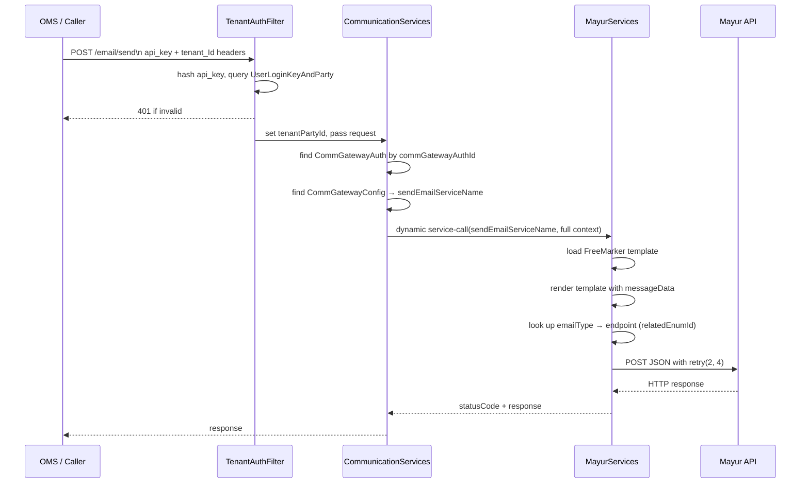

# UniMail — Uniform Email Gateway

UniMail is the email-side of Unigate. It gives callers a single API surface for sending transactional emails and tracking lifecycle events, regardless of which email provider the tenant has configured. The routing from abstract operation to concrete provider is driven entirely by database configuration — no code changes are needed to switch providers or add new ones.

---

## How Routing Works

Every UniMail API call carries a `commGatewayAuthId`. `CommunicationServices` uses this to:

1. Look up the `CommGatewayAuth` record (tenant credentials + endpoint)
2. Follow its `commGatewayConfigId` to `CommGatewayConfig` (which provider)
3. Read the relevant `*ServiceName` field to get the fully-qualified Moqui service name
4. Call that service dynamically, passing the full request context through

This means the routing layer has zero knowledge of individual providers. All provider logic lives in the implementation service.

---

## Entities

UniMail uses the shared Unigate tenant identity entities (`Party`, `Organization`, `PartyRole`) plus two of its own configuration entities:

### `CommGatewayConfig`

Defines which services handle each abstract operation for a given provider. One record per provider, shared across all tenants. See the [Entity Model documentation](../entity/entity-model.md) for full configuration details.

### `CommGatewayAuth`

Per-tenant credential and endpoint data for a specific provider. One record per tenant+provider combination.
See the [CommGatewayAuth entity doc](../entity/comm-gateway-auth.md) for the full field list, encryption details, and setup workflow.

---

## APIs

### `POST /email/send` — Send an Email

Routes to `CommunicationServices.send#EmailCommunication`, which delegates to the provider's `sendEmailServiceName`.

**Required headers:** `api_key`, `tenant_Id`

See the [send#EmailCommunication](./services/send-email-communication.md) service documentation for detailed request and response payload schemas.

**Error responses:**

| Condition | Response |
|---|---|
| Missing/invalid `api_key` or `tenant_Id` | `401 Unauthorized` |
| `commGatewayAuthId` not found | `error=true`, message: "No valid gateway auth config found for tenant" |
| `CommGatewayConfig` not found | `error=true`, message: "Email gateway configuration not found" |
| `sendEmailServiceName` not set on config | `error=true`, message: "Gateway config is missing sendEmailServiceName service name" |

---

### `POST /email/flow` — Create an Email Flow

Routes to `CommunicationServices.create#EmailFlow`, which delegates to `createFlowServiceName`. See the [services directory](./services/) for detailed explanations of all email APIs.

---

## Related Documents

- [CommGatewayAuth](../entity/CommGatewayAuth.md) — credential entity reference
- [Add Email Gateway](./add-email-gateway.md) — integrating a new email provider
- [send#EmailCommunication](./services/send-email-communication.md) — email sending service design
- [create#EmailFlow](./services/create-email-flow.md) — automated flow provisioning design
- [get#EmailFlow](./services/get-email-flow.md) — flow status retrieval design
- [Tenant Onboarding](../tenant-onboarding.md) — provisioning a tenant with email access
- [TenantAuthFilter](../tenant-auth-filter.md) — request authentication
