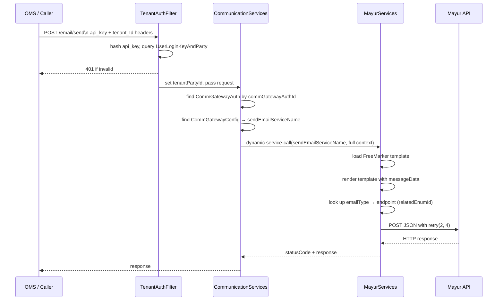

# UniMail — Uniform Email Gateway

UniMail is the email-side of Unigate. It gives callers a single API surface for sending transactional emails and tracking lifecycle events, regardless of which email provider the tenant has configured. The routing from abstract operation to concrete provider is driven entirely by database configuration — no code changes are needed to switch providers or add new ones.


---

## How Routing Works

Every UniMail API call carries a `commGatewayAuthId`. `CommunicationServices` uses this to:

1. Look up the `CommGatewayAuth` record (tenant credentials + endpoint)
2. Follow its `commGatewayConfigId` to `CommGatewayConfig` (which provider)
3. Read the relevant `*ServiceName` field to get the fully-qualified Moqui service name
4. Call that service dynamically, passing the full request context through

This means the routing layer has zero knowledge of individual providers. All provider logic lives in the implementation service.



---

## Entities

UniMail uses the shared Unigate tenant identity entities (`Party`, `Organization`, `PartyRole`) plus two of its own configuration entities:

### `CommGatewayConfig`

Defines which services handle each abstract operation for a given provider. One record per provider, shared across all tenants.

```xml
<entity entity-name="CommGatewayConfig" package="co.hotwax.unigate" use="configuration" cache="true">
    <field name="commGatewayConfigId" type="id" is-pk="true"/>
    <field name="description" type="text-medium"/>
    <field name="sendEmailServiceName" type="text-medium"/>
    <field name="createEventServiceName" type="text-medium"/>
    <field name="createFlowServiceName" type="text-medium"/>
    <field name="getFlowServiceName" type="text-medium"/>
</entity>
```

Example record for Klaviyo:
```json
{
    "createEventServiceName": "co.hotwax.communication.klaviyo.KlaviyoServices.create#WorkflowEvent",
    "createFlowServiceName": "co.hotwax.communication.klaviyo.KlaviyoServices.create#KlaviyoEmailFlow",
    "lastUpdatedStamp": "2026-06-30T05:31:05+0000",
    "getFlowServiceName": "co.hotwax.communication.klaviyo.KlaviyoServices.get#KlaviyoEmailFlow",
    "description": "Klaviyo gateway",
    "commGatewayConfigId": "KLAVIYO",
    "sendEmailServiceName": "co.hotwax.communication.klaviyo.KlaviyoServices.send#EmailCommunication",
    "_entity": "co.hotwax.unigate.CommGatewayConfig"
}
```

### `CommGatewayAuth`

Per-tenant credential and endpoint data for a specific provider. One record per tenant+provider combination.

See [CommGatewayAuth entity doc](../entity/CommGatewayAuth.md) for the full field list, encryption details, and setup workflow.

Key fields for routing:
- `commGatewayConfigId` → which provider
- `baseUrl` → provider base URL
- `authHeaderName` + `apiKey` → how to authenticate (varies by `authTypeEnumId`)

---

## APIs

### `POST /email/send` — Send an Email

Routes to `CommunicationServices.send#EmailCommunication`, which delegates to the provider's `sendEmailServiceName`.

**Required headers:** `api_key`, `tenant_Id`

**Request:**
```json
{
  "commGatewayAuthId": "MAYUR_ACME_PROD",
  "emailType": "ORDER_COMPLETION",
  "subject": "Your order is confirmed",
  "emailAddress": "customer@example.com",
  "messageData": {
    "orderId": "ORD123",
    "orderName": "ORD-2025-001",
    "orderDate": "2025-01-15",
    "firstName": "Jane",
    "lastName": "Smith",
    "grandTotal": 99.99,
    "items": [
      {
        "productId": "PROD001",
        "productName": "Widget",
        "quantity": 2,
        "unitPrice": 49.99,
        "color": "Red",
        "size": "M"
      }
    ],
    "shippingAddress": {
      "toName": "Jane Smith",
      "address1": "123 Main St",
      "city": "New York",
      "stateProvinceGeoId": "NY",
      "postalCode": "10001",
      "countryGeoId": "USA",
      "phoneNumber": "2125551234"
    }
  }
}
```

**Response (Mayur):**
```json
{
  "response": {
    "statusCode": 200,
    "message": "Email sent successfully"
  },
  "requestBody": { ... }
}
```

**Error responses:**

| Condition | Response |
|---|---|
| Missing/invalid `api_key` or `tenant_Id` | `401 Unauthorized` |
| `commGatewayAuthId` not found | `error=true`, message: "No valid gateway auth config found for tenant" |
| `CommGatewayConfig` not found | `error=true`, message: "Email gateway configuration not found" |
| `sendEmailServiceName` not set on config | `error=true`, message: "Gateway config is missing sendEmailServiceName service name" |

---

### `POST /email/flow` — Create an Email Flow

Routes to `CommunicationServices.create#EmailFlow`, which delegates to `createFlowServiceName`. See the [services directory](./services/) for detailed explanations of all email APIs.

**Request:**
```json
{
  "commGatewayAuthId": "KLAVIYO_ACME_PROD",
  "emailType": "ORDER_CANCELLATION",
  "subject": "ORDER_CANCELLATION",
  "fromAddress": "no-reply@example.com"
}
```
---

## Mayur Implementation Details

Mayur is the only currently implemented email provider. The service lives in `service/co/hotwax/communication/mayur/MayurServices.xml`.

**`send#EmailCommunication` flow:**
1. Loads `CommGatewayAuth` by `commGatewayAuthId`
2. Loads FreeMarker template: `component://unigate/template/mayur/SendBOPISEmailTemplate.ftl`
3. Renders template with `messageData` context to generate a JSON request body
4. Looks up the `emailType` enumeration to resolve the endpoint path (via `relatedEnumId`)
5. Calls `MayurServices.send#MayurRequest` with the endpoint and body

**`send#MayurRequest`** is the generic HTTP handler:
- Constructs `baseUrl + endPoint` (handles trailing slashes)
- Uses Moqui's `RestClient` with `timeoutRetry(true)` and `retry(2, 4)` for resilience
- Returns raw `statusCode` and response text to the caller
- Auth: `commGatewayAuth.publicKey` used as the bearer/header value

---

## Related Documents

- [CommGatewayAuth](../entity/CommGatewayAuth.md) — credential entity reference
- [Add Email Gateway](./add-email-gateway.md) — integrating a new email provider
- [send#EmailCommunication](./services/send-email-communication.md) — email sending service design
- [create#EmailFlow](./services/create-email-flow.md) — automated flow provisioning design
- [get#EmailFlow](./services/get-email-flow.md) — flow status retrieval design
- [Tenant Onboarding](../tenant-onboarding.md) — provisioning a tenant with email access
- [TenantAuthFilter](../TenantAuthFilter.md) — request authentication
