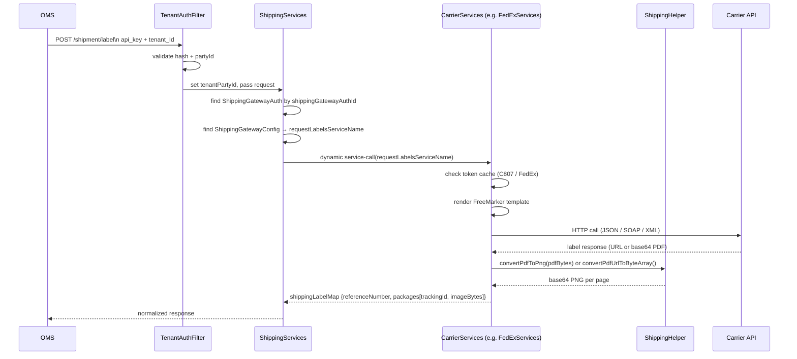

# UniShip — Uniform Shipping Gateway

UniShip is the shipping side of Unigate. It provides a single, stable REST API for rate shopping, label generation, and label cancellation across multiple carriers. The OMS sends a self-contained shipment payload; UniShip routes it to the right carrier, handles carrier-specific auth, transforms the payload, and returns a normalized response.

**Supported carriers:** FedEx, Purolator (SOAP), Canada Post (XML), ShipHawk, C807, DrivIn.

UniShip is **stateless** — it does not persist shipment data. Every request must be fully self-contained.

---

## How Routing Works

Every shipping API call carries a `shippingGatewayAuthId`. `ShippingServices` uses this to:

1. Look up `ShippingGatewayAuth` → gets tenant credentials + carrier endpoint
2. Follow its `shippingGatewayConfigId` to `ShippingGatewayConfig` → finds which carrier service to call
3. Dynamically invoke that carrier service, passing the full request context



---

## API Reference

All endpoints require `api_key` and `tenant_Id` headers. See [TenantAuthFilter](../TenantAuthFilter.md) for authentication details.

### `POST /shipment/rate` — Get Shipping Rate

Routes to `ShippingServices.get#ShippingRate`.

**Request:**
```json
{
  "shippingGatewayAuthId": "FEDEX_ACME_PROD",
  "originAddress": {
    "toName": "Acme Warehouse",
    "address1": "100 Warehouse Ln",
    "city": "Los Angeles",
    "stateOrProvinceCode": "CA",
    "countryCode": "US",
    "postalCode": "90001",
    "phoneNumber": "2135551234"
  },
  "destAddress": {
    "toName": "Jane Smith",
    "address1": "456 Oak Ave",
    "city": "New York",
    "stateOrProvinceCode": "NY",
    "countryCode": "US",
    "postalCode": "10001",
    "residential": "Y"
  },
  "weightValue": 5.0,
  "weightUnit": "LB",
  "parcels": [
    { "length": 10, "width": 8, "height": 6, "weightValue": 5.0, "weightUnit": "LB" }
  ],
  "shipmentMethod": "GROUND"
}
```

**Response:**
```json
{
  "success": true,
  "shippingRates": [
    {
      "carrierService": "FedEx Ground",
      "shipmentMethod": "GROUND",
      "shippingEstimateAmount": 12.50,
      "estimatedDeliveryDate": "2025-01-17",
      "gatewayRateId": "rate_fedex_001"
    }
  ]
}
```

---

### `POST /shipment/label` — Request Shipping Label

Routes to `ShippingServices.request#ShippingLabels`. Returns base64-encoded label images.

**Response:**
```json
{
  "success": true,
  "shippingLabelMap": {
    "referenceNumber": "CARRIER_REF_123",
    "packages": [
      {
        "trackingIdNumber": "7654321098",
        "imageBytes": "<base64-encoded PNG>"
      }
    ]
  }
}
```

`imageBytes` is a 300 DPI PNG of the label, ready for printing or display.

---

### `POST /shipment/label/refund` — Cancel / Refund Labels

Routes to `ShippingServices.refund#ShippingLabels`.

**Request:**
```json
{
  "shippingGatewayAuthId": "PUROLATOR_ACME_PROD",
  "trackingIds": ["7654321098", "7654321099"]
}
```

**Response:**
```json
{ "success": true, "errorMessages": null }
```

---

### Token Caching

**FedEx and C807** use short-lived OAuth tokens. Requesting a new token on every API call would add latency and risk rate limiting.

Both use Moqui's distributed cache:
- **Key**: `tenantPartyId|shippingGatewayConfigId`
- **C807 cache TTL**: 86,400 seconds (24 hours); configured in `MoquiConf.xml`
- **FedEx**: cache key checked against internal `expiresAt` with a 2-minute buffer before expiry

The cache is global (shared across requests). The token is only fetched when the cached entry is missing or expired.

---

## Entities

- **[ShippingGatewayConfig](../entity/ShippingGatewayConfig.md)** — which service handles each operation for a carrier
- **[ShippingGatewayAuth](../entity/ShippingGatewayAuth.md)** — per-tenant credentials for a specific carrier

For the multi-facility / multi-account credential pattern (one tenant, many carrier accounts), see [Carrier Account Management](./CarrierAccountManagement.md).

---

## Design Principles

These principles are enforced at the API contract level:

- **Self-contained requests** — origin address, destination address, package list (with explicit weight and dimension UOMs), and carrier method must all be in the request. UniShip never looks up data by ID.
- **No shipment persistence** — UniShip does not store shipment data. The OMS owns the data lifecycle.
- **Synchronous only** — all APIs are synchronous. OMS is responsible for retry on transient failure.
- **Explicit UOMs** — weight units (`LB`, `KG`) and dimension units (`IN`, `CM`) must be specified per package, never assumed.

---

## Error Handling

| Layer | Condition | Behavior |
|---|---|---|
| Auth | Missing `api_key` or `tenant_Id` | `401` with "Missing authentication headers." |
| Auth | Hash mismatch or partyId mismatch | `401` with "Invalid credentials." |
| Routing | `ShippingGatewayAuth` not found | `error=true`, "No valid gateway auth config found for tenant" |
| Routing | `ShippingGatewayConfig` not found | `error=true`, "Shipping gateway configuration not found" |
| Carrier | HTTP 4xx/5xx from carrier API | `success=false`, `errorMessages` contains status code + raw response |

Carrier errors propagate `success=false` rather than throwing an exception. The OMS should check `success` in the response before using the payload.

---

## Related Documents

- [Add Shipping Carrier](./add-shipping-carrier.md) — integrating a new carrier
- [Carrier Account Management](./CarrierAccountManagement.md) — multi-facility credential pattern
- [get#ShippingRate](./services/get-shipping-rate.md) — rate service design
- [request#ShippingLabels](./services/requestShippingLabel.md) — label service design
- [refund#ShippingLabels](./services/refundShippingLabels.md) — refund service design
- [ShippingGatewayAuth](../entity/ShippingGatewayAuth.md) — credential entity
- [ShippingGatewayConfig](../entity/ShippingGatewayConfig.md) — gateway config entity
- [Tenant Onboarding](../tenant-onboarding.md) — provisioning a tenant
