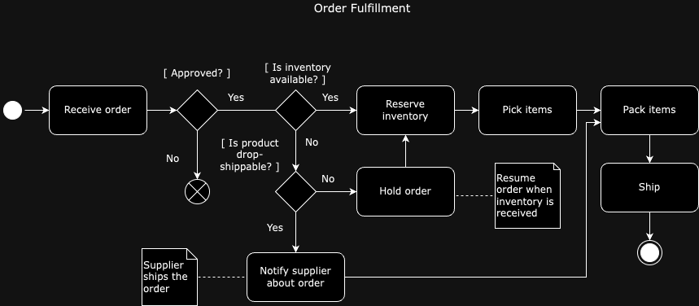

# Order Data Model in Apache OFBiz

## Entities Overview

### 1. OrderHeader
- **Description**: Represents the general details of an order including type, status, and customer information. It is the primary entity for an order.
- **Key Fields**: orderId, orderDate, orderStatus, partyId, grandTotal.

### 2. OrderItem
- **Description**: Details each item in the order. It is linked to the OrderHeader by orderId and contains product details, quantity, and price.
- **Key Fields**: orderId, orderItemSeqId, productId, quantity, unitPrice.

### 3. OrderItemShipGroup
- **Description**: Manages shipping details for an order. It groups multiple OrderItems for shipping purposes and links to shipping information via contactMechId. Also links to the OrderHeader.
- **Key Fields**: orderId, shipGroupSeqId, shipmentMethodTypeId, facilityId, contactMechId.

### 4. ContactMech
- **Description**: A general-purpose entity for various contact mechanisms. In the context of shipping, it is used to reference a postal address.
- **Key Fields**: contactMechId, contactMechTypeId.

### 5. PostalAddress
- **Description**: Stores detailed postal address information. It is linked to ContactMech for address details.
- **Key Fields**: contactMechId, toName, attnName, address1, city, postalCode, countryGeoId.

### 6. OrderAdjustment
- **Description**: Handles adjustments to the order's pricing, including discounts, taxes, or shipping charges. Linked to OrderHeader, OrderItem, or OrderItemShipGroup.
- **Key Fields**: orderAdjustmentId, orderAdjustmentTypeId, orderId, orderItemSeqId, shipGroupSeqId, amount.

### 7. Party
- **Description**: Represents an individual, group, or organization involved in the order. Essential for linking orders to the entities involved.
- **Key Fields**: partyId, partyTypeId, preferredCurrencyUomId, statusId, description.

### 8. OrderRole
- **Description**: Links a Party to the role they play in an Order, such as a bill-to or ship-to customer.
- **Key Fields**: orderId, partyId, roleTypeId.

### 9. PartyRole
- **Description**: Indicates the roles a Party can play within the organization, not limited to order management.
- **Key Fields**: partyId, roleTypeId.

### 10. RoleType
- **Description**: Defines the types of roles assignable to a Party, crucial for categorizing Party roles.
- **Key Fields**: roleTypeId, parentTypeId, description.

## Entity Relationships

- **OrderAdjustment to OrderHeader**: Linked via OrderId for associating adjustments to the specific order.
- **OrderAdjustment to OrderItem**: Through OrderItemSeqId for item-specific adjustments.
- **OrderAdjustment to OrderItemShipGroup**: Via ShipGroupSeqId for shipping-related adjustments.
- **OrderItemShipGroup to OrderHeader**: Linked via orderId, associating the shipping group with its order.
- **OrderItemShipGroup to ContactMech**: Connected through contactMechId for shipping address details.
- **PostalAddress to ContactMech**: Linked by contactMechId, providing detailed address information.
- **OrderRole to OrderHeader**: Linked via orderId, associating a party and their role with a specific order.
- **OrderRole to Party**: Connected through partyId, specifying which party is playing a role in the order.
- **PartyRole to Party**: Linked via partyId, defining the different roles a party can play across various business processes.
- **PartyRole to RoleType**: Connected through roleTypeId, categorizing the roles available for parties.

## JSON Data Example

```json
{
  "OrderHeader": {
    "orderId": "10001",
    "orderDate": "2024-01-03",
    "orderStatus": "CREATED",
    "partyId": "C100",
    "grandTotal": 95.00
  },
  "OrderItems": [
    {
      "orderId": "10001",
      "orderItemSeqId": "00001",
      "productId": "P100",
      "quantity": 2,
      "unitPrice": 20.00
    },
    {
      "orderId": "10001",
      "orderItemSeqId": "00002",
      "productId": "P200",
      "quantity": 1,
      "unitPrice": 50.00
    }
  ],
  "OrderItemShipGroup": {
    "orderId": "10001",
    "shipGroupSeqId": "01",
    "shipmentMethodTypeId": "STANDARD",
    "facilityId": "FAC100",
    "contactMechId": "CM100"
  },


  "ContactMech": {
    "contactMechId": "CM100",
    "contactMechTypeId": "POSTAL_ADDRESS"
  },
  "PostalAddress": {
    "contactMechId": "CM100",
    "toName": "Customer Name",
    "attnName": "Receiving Department",
    "address1": "123 Main St",
    "city": "Metropolis",
    "postalCode": "12345",
    "countryGeoId": "USA"
  },
  "OrderAdjustment": [
    {
      "orderAdjustmentId": "ADJ1001",
      "orderAdjustmentTypeId": "SHIPPING_CHARGES",
      "orderId": "10001",
      "orderItemSeqId": null,
      "shipGroupSeqId": "01",
      "amount": 5.00
    }
  ],
  "OrderRole": [
    {
      "orderId": "10001",
      "partyId": "C100",
      "roleTypeId": "BILL_TO_CUSTOMER"
    },
    {
      "orderId": "10001",
      "partyId": "C100",
      "roleTypeId": "PLACING_CUSTOMER"
    }
  ],
  "Parties": [
    {
      "partyId": "C100",
      "partyTypeId": "PERSON",
      "preferredCurrencyUomId": "USD",
      "statusId": "ACTIVE",
      "description": "John Doe"
    },
    {
      "partyId": "S200",
      "partyTypeId": "ORGANIZATION",
      "preferredCurrencyUomId": "EUR",
      "statusId": "ACTIVE",
      "description": "ACME Corporation"
    }
  ],
  "PartyRoles": [
    {
      "partyId": "C100",
      "roleTypeId": "CUSTOMER"
    },
    {
      "partyId": "S200",
      "roleTypeId": "SUPPLIER"
    }
  ],
  "RoleTypes": [
    {
      "roleTypeId": "CUSTOMER",
      "parentTypeId": null,
      "description": "Customer Role"
    },
    {
      "roleTypeId": "SUPPLIER",
      "parentTypeId": null,
      "description": "Supplier Role"
    }
  ]
}
```


**Order lifecyle**



https://app.diagrams.net/#G0BykZZYyGnR7UQlpsc3MwUGtfRVU
